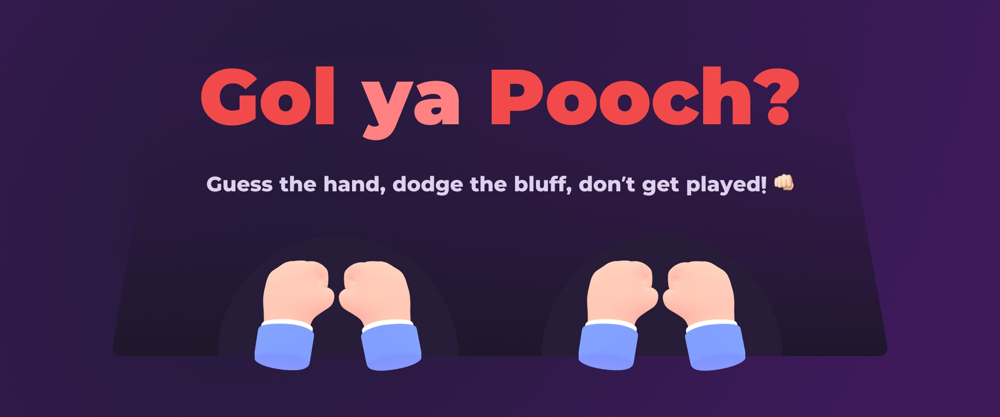

# 👊🏻 **Gol ya Pooch** - Real-time Multiplayer Guessing Game

**Gol ya Pooch is a fun and fast-paced realtime multiplayer guessing game brought to the web! 🕹️ One player hides the “gol” (a small object) in one hand, and the other has to figure out which hand it’s in. It’s all about bluffing, quick thinking, and outsmarting your opponents. Guess the hand, dodge the bluff, and don’t get played! 🎯**

 

---

## 🚀 **Features**

- **Real-time Multiplayer**: Play with friends or opponents online in real time.
- **Classic Gameplay**: Simple and nostalgic "Guess the Hand" game, now on the web.
- **Fast & Fun**: Quick rounds, sneaky bluffs, and hilarious wins.
- **More surprises on the way...** ✨ Stay tuned for epic updates! 🚀

---

## 🛠️ **Tech Stack**

- **Front-end**: React, Wouter, Zustand, socket.io-client, Spline, Motion
- **Back-end**: NestJS + WebSocket (Socket.IO)
- **Database**: Redis (for game states)
- **Real-time**: WebSocket for live communication
- **Deployment**: Coolify  

---

## 🎲 **How to Play**

1. **Create or Join a Room**: Start a game room or join one with your friends.
2. **Press ready button**: Press the Ready button whenever you are ready to start the game.
3. **Hide the "Gol"**: One player hides the object in one hand.
4. **Guess the Hand**: Other players guess where the “gol” is hiding.
5. **Win or Bluff**: Bluff your way to victory or catch your opponent slipping!

The game ends when a player reaches the winning score.  

---

## 🤝 **Contributing**

Pull requests are welcome! If you have ideas for improving gameplay or features, open an issue and let's collaborate.

---

## 📜 **License**

This project is licensed under the MIT License.
